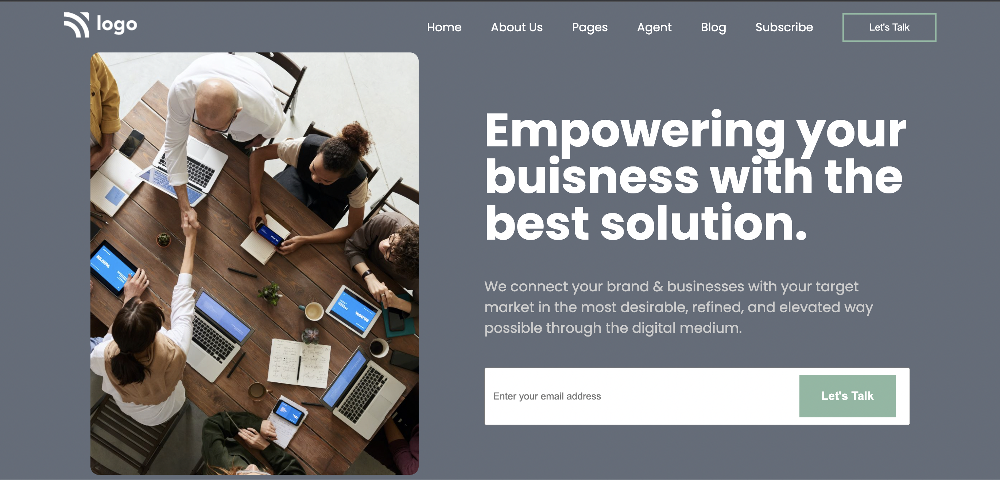

# Assignment 1

## PROJECT 12 - [LINK ](https://liveproj-12.netlify.app/)

-   Skills Gained in this project
    -   Learned to use the object-fit.
    -   Learned to use the object-position.

## Time taken to finish this project

-   3 hour taken to complete it.

